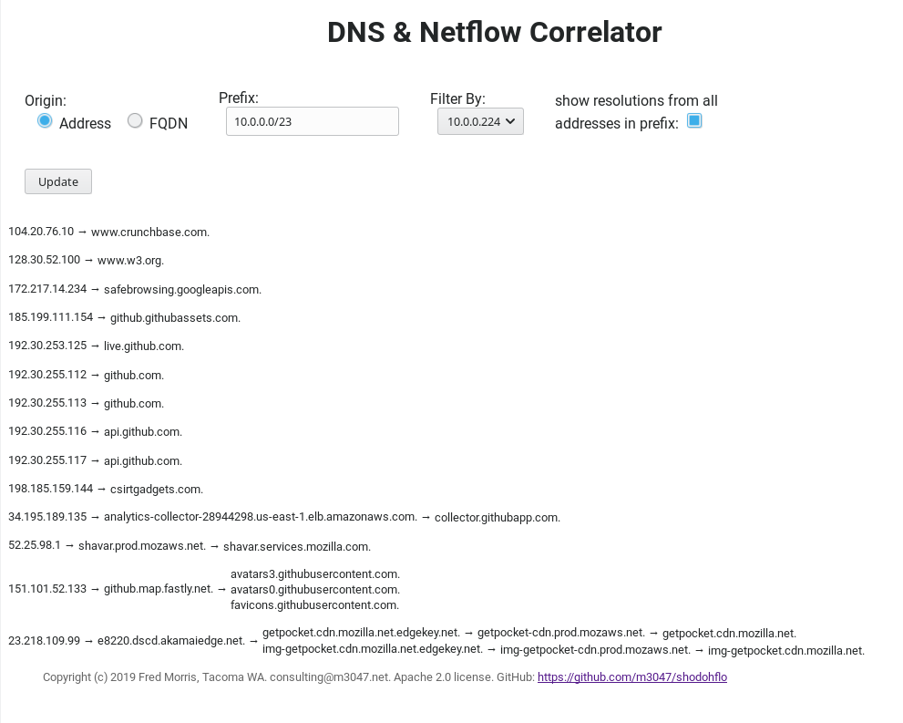

# "Show DoH Flow": DNS and netflow correlator

This tool was inspired by a need to see whether netflows correlated with DNS lookups, which in turn is motivated by
the push for _DNS over HTTP_. DoH apparently appeals to people who want to trade visibility into DNS traffic by their
coffee shop for visibility into that traffic by advertising and cloud infrastructure providers. On the other hand
that local DNS traffic is utilized in offices and other controlled access environments as an access control / auditing
mechanism.

### Installation

1. Follow the general instructions in the `install/` directory.
1. Make sure you have `Flask` and `redis` installed. Both are available with `pip3`.
1. Copy `configuration_sample.py` to `configuration.py` and make any changes.
1. Make sure the agents are running and capturing data to _Redis_. You might run `examples/count_client_keys.py` to verify this.
1. You should be able to run `app.py` and point a browser at it. By default it will be at `http://localhost:3047/`.

This is a _WSGI_ app. For security and other reasons you probably don't want to put the _Werkzeug_ app directly up
on the internet. The _Flask_ documentation discusses numerous deployment options: http://flask.pocoo.org/docs/1.0/deploying/

##### Bookmarking

I find it useful to bookmark the URI for filtered client data on that particular device. The URI for a client typically follows
this pattern:

    http://<server>:<port>/address?prefix=<network>&filter=<client-address>&all=all
    
* **server**: The location where this app is running.
* **port**: The port the app is running on
* **network**: A network, specified as `<ip-address>/<bits>`, for example `10.0.0.0%2F24` should be specified to represent `10.0.0.0/24`. It is necessary to URL escape the `/` character; use `%2F` instead.
* **client-address** The address of the client of interest.
* **all=all** Allows information about other clients to be used to fill in missing information for this client.

The app uses `GET`, so all of the above arguments (and a few more) will be present in the URL; you can probably just bookmark the page while looking at it, and then edit the resulting URL to remove extraneous stuff.

### Skins / Themes

The skin which is used is determined by the `template` parameter provided with the GET request, or if not supplied by the
`DEFAULT_TEMPLATE` configuration setting. The available templates are determined by the `AVAILABLE_TEMPLATES` configuration
setting.

A _skin_ consists of two items. Assuming that the name of the skin is `my_skin`:

* **a renderer** in `renderers/`, with the name `my_skin.py`
* **a template** in `templates/`, with the name `my_skin.html`

In most cases the template will in turn reference CSS styles in `static/`.

##### Shipped skins

Two skins are shipped:

* **graph** is the vanilla, very first version
* **graph2** which is now the default, has rollovers which provide additional metadata:
  * **targets** for recon netflow indicators, this was the target of the netflow
  * **clients** the "our network" addresses which generated the artifacts or for recon the originator
  * **types** the type of artifact; usually there is only one
  * **ports** netflows, only used when the origin is _address_, provide a list of the remote ports or for recon netflows both the source and destination ports

### UI Elements

##### Origin

Allows switching between netflow or DNS -first views of artifact chains.

##### Prefix

This the network prefix encompassing all observed "our network" clients. You can override it to make it larger or smaller. If not supplied, it is calculated.

##### Filter By

This dropdown enumerates all of the observed "our network" clients. You can use it to restrict the display to a single client.

##### Show resolution from all addresses in the prefix

If checked, then the client specified with _Filter By_ is required to originate a chain, but relevant information from other clients is added to the chain. Information from other clients is displayed grayed out.

##### Update

Refreshes the current view.

##### Clear

The _Clear_ button will clear collected data for the address specified in _Filter_, and if _Filter_ is set to
`--all--` then all data is cleared.

### Recon Netflows

Recon artifacts are indicated by the address being in a shade of red. Recon artifacts are presented for netflows only.
Both clients (originators) and targets (destinations) of the flow are indicated for addresses on the own network as well as remote; **this includes
flows which are strictly within the own network**.

The rationale for including this is the revelation that some web sites are probing their local environment (and some web browsers are
allowing it!).

There are two triggers for this artifact:

* **ICMP Type 3 (Destination Unreachable)** These indicate that a port or host is unreachable; or they can indicate that a network is
unreachable. We just group them all together.
* **TCP RST** Many network stacks respond with RST (rather than ICMP type 3) when a port is not open for TCP.

Since these are a hypothetical server responding about service availability, the source and
destination are reversed from the actual flow over the wire. The _client_ is the address which sent the undeliverable packet and the _target_
is the address they sent it to. Port numbers follow the same semantics.

##### False positives

I have two devices on my SOHO network which produce false positives regularly:

* **ICMP Destination Unreachable for own DNS requests** I have a _Roku_ and an _Asus_ wireless repeater which regularly emit _ICMP Port Unreachable_ when the nameserver replies to their legitimate (?) DNS requests. This shows up as a source port 53 and a destination high port originating from the evil nameserver and targeting the poor dumb device.
* **Netbios, Rendezvous, etc.** The _Asus_ repeater periodically probes for TCP services. I don't know why, and I've never been able to shut it off. I view it as a free pentesting service.
