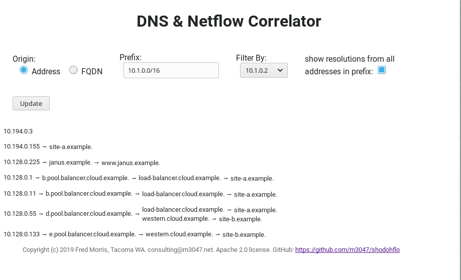
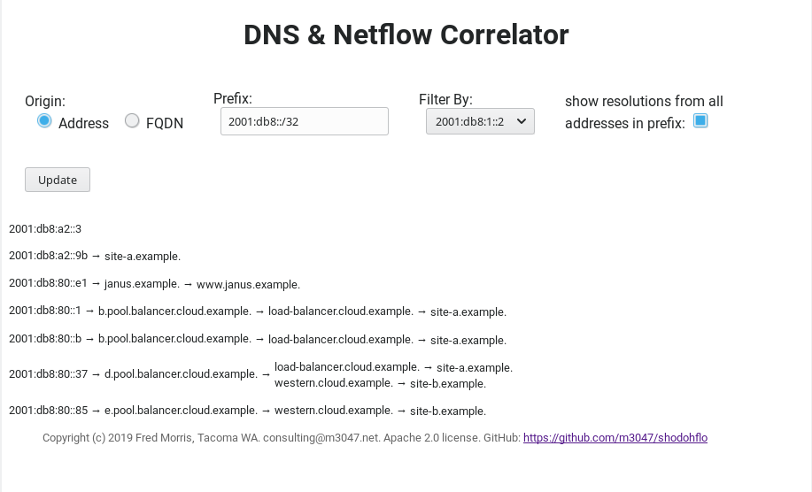
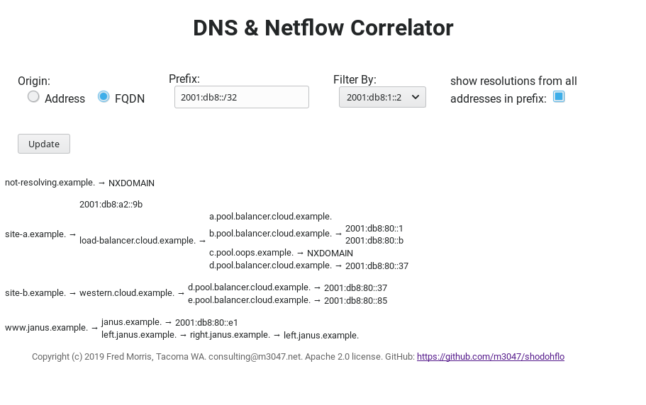

### Using this Test Data

The script `test_data.py` adds (more or less) consistent test entries to your _Redis_ database.

    test_data.py [4|6]

The parameter must be either `4` for IPv4 data or `6` for IPv6 data. All test data is created in private address
space, and the TLD `.example` is used. The first thing the script does is print out the test addresses / networks
it is creating.

The address identified as `OUR_1_CLIENT` in the code is assigned, as a client, for all of the test artifacts; the clients
`OUR_2_CLIENT` and `OUR_3_CLIENT` get probabilistically part of the data assigned to each (the artifacts assigned to
each will change each time the script is run).

By default the client addresses assigned are...

IPv4:
```
  OUR_1_CLIENT: 10.1.0.2
  OUR_2_CLIENT: 10.1.0.52
  OUR_3_CLIENT: 10.1.0.221
```

IPv6:
```
  OUR_1_CLIENT: 2001:db8:1::2
  OUR_2_CLIENT: 2001:db8:1::34
  OUR_3_CLIENT: 2001:db8:1::dd
```

### Screenshots

Four screenshots are provided below, using the (default) `OUR_1_CIENT` address for both IPv4 and IPv6. This client
references all of the sample data.

## IPv4 by address



## IPv4 by FQDN


## IPv6 by address



## IPv6 by FQDN


